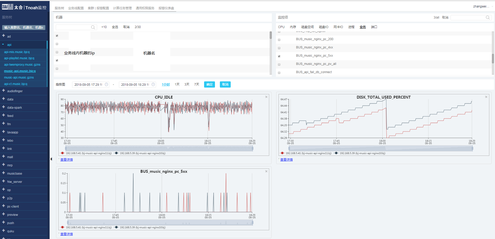
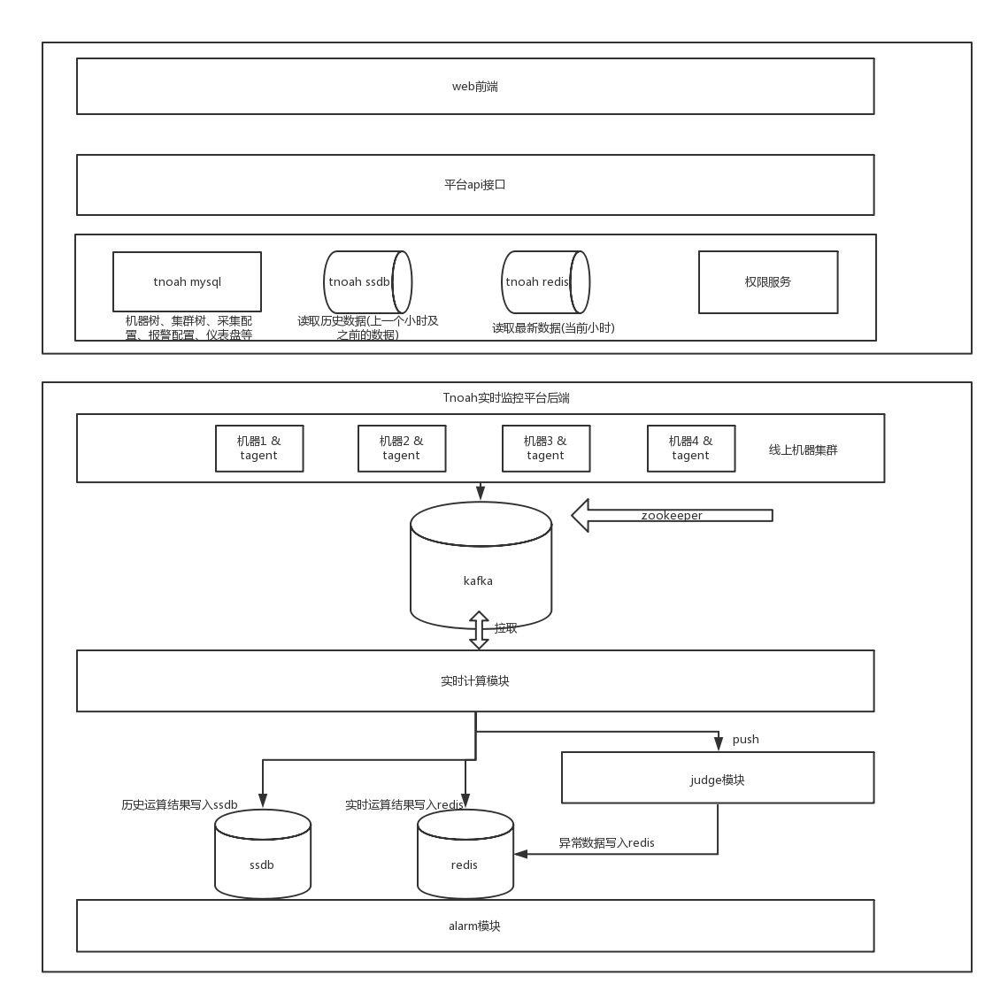
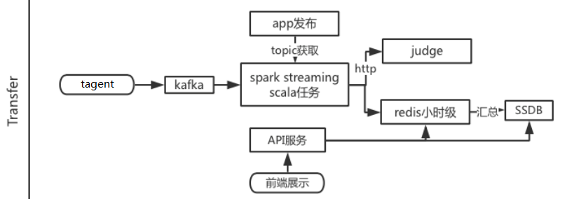
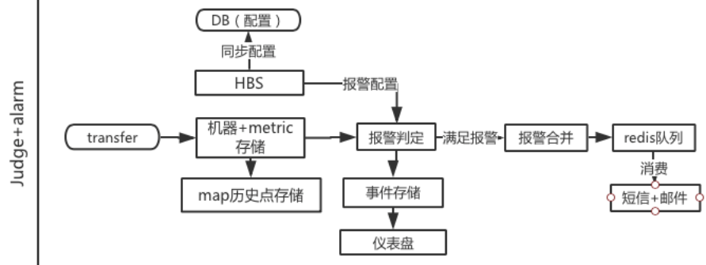

# Tnoah—实时监控平台介绍
## 1.概述
为了近实时了解各个业务系统的运行状态, 千千音乐需要一套系统, 对机器硬件性能指标、业务系统、进程端口等进行必要的实时监控。我们最初采用第三方监控工具, 虽然能够近实时了解各个业务系统的运行状态, 但考虑到成本、不开源、功能不可定制等问题，最终还是决定建设一套自己的实时监控平台。

经过近一年的开发与迭代(大部分是满足日常业务需求之余抽出时间开发 :< )，目前已经全量部署在所有机器，并基本稳定运行。非常幸运能够全程参与Tnoah的开发, 这篇文章我将简单总结Tnoah监控系统的体系结构, 实现原理。

__Tnoah是一个开源平台, 作为新生儿, 目前还有许多不完善之处, 欢迎使用体验以及参与完善。__
__项目地址:https://github.com/taihedeveloper/Tnoah__

## 2.体系结构
### 2.1Tnoah的组成部分及环境依赖:
* Tnoah web
    * 前端 (vue.js)
    * api (php)
    * 权限服务 (openresty)
* 计算部分
    * tagent采集模块   (C++)
    * transfer实时计算模块 (scala)
    * judge模块        (go, 针对open-falcon项目judge模块二次开发)
    * alarm模块        (go, 针对open-falcon项目judge模块二次开发)

### 2.2Tnoah采用的存储
* Mysql : 存放平台机器树、服务树、报警配置、监控配置、权限配置、仪表盘等信息
* Redis ：存放当前小时的采集项数据(3小时内)
* Ssdb  : 存放历史的小时级、天级数据 (>3小时的数据, 并有脚本定期清理2个月以前的数据)
* kafka : tagent将采集到的数据写入, spark消费数据

### 2.3Tnoah的体系结构图

## 3.实现原理
Tnoah web包括前端、api和权限服务组成, 
计算部分包括tagent采集模块、spark实时计算模块、judge模块、alarm模块组成。
### Tnoah web
Tnoah web是平台的前端, 使用者可以通过访问Tnoah Web 完成以下操作：
* 查看用户所管理的服务树、机器树、以及具体机器的采集项。
* 编辑平台权限、权限组
* 编辑服务树、集群、机器
* 配置监控项
* 配置报警项、报警规则、报警模板
* 查看报警仪表盘

### tagent
tagent需要部署在需要监控的机器上, tagent工作时作为系统的采集器, 会做一些采集工作：
* 定时(间隔10秒)采集设备硬件信息、端口信息、进程信息
* 根据配置文件(支持热加载), 实时采集机器日志信息并做匹配, 每隔10秒做一次合并，并将合并的数据写入kafka

上述工作, 硬件信息主要是通过提取/proc 路径下相关文件数据, 进行计算得到, 下面谈谈tagent的实现重点及解决方案:
1、端口信息和进程信息分别通过外部命令 ss 、 ps 命令取得;
2、日志信息采用linux提供的的inotify api, 以非阻塞的方式读取, 避免了轮询以确保性能;
3、配置文件(伪)热加载： 
* 为什么要实现热加载, 原因是，tagent需要与外部通讯, 但我们又希望让tagent像个"孤岛"一样尽量无状态。当用户配置好新的采集配置并点击下发按钮后, web会调用一个保存的接口, 这个接口会将新的配置文件以 scp 命令到指定的机器上, 这时实现了热加载的tagent就能实时更新, 重新读取配置文件并加载到内存。
* 热加载的实现同样通过inotify api, 当热加载线程检测到item_conf目录下有变动, 会重新执行一遍初始化操作。
4、tagent最初采用flume向kafka写数据, 但这样会有一定的环境依赖, 部署流程也比较复杂, 内存占用较大, 后来去掉了flume, 通过集成librdkafka, 直接向kafka写数据, 解决了上述弊端。

### transfer实时计算模块
实时计算模块的工作内容是：
消费kafka中tagent上报的监控数据，以10s的时间间隔批处理解析日志，一方面将结构化的数据存入redis供前端查询展示，一方面将数据通过http接口post给judge模块

系统选用kafka原因：
1、解耦   tagent采用c++开发，实时计算模块采用scala开发，两者可以独立地扩展、开发
2、缓冲
3、kakfa与sparkstreaming结合性较好，有很多比较成熟的案例
4、kafka具有良好的可扩展性

### judge模块 & alarm模块
judge模块和alarm模块是基于open-falcon项目中judge、alarm模块的二次开发
其中, 我们对judge、alarm模块保持大体不变, 做了如下定制：
* judge：报警屏蔽
* judge：tagent健康检测
* alarm：微信公众号提醒

### 定时任务
由于redis容量有限, 我们会通过一些离线脚本, 定时把redis中的数据"搬"至ssdb。
相应的, Tnoah web的获取数据接口在读数据时, 也会对时间范围做判断, 一定时间内的数据会从redis中读取, 而较久的数会从ssdb读取, 如果请求的时间刚好包含这两部分时间, 则会分别从redis和ssdb中读取, 并对读取到的数据做合并

